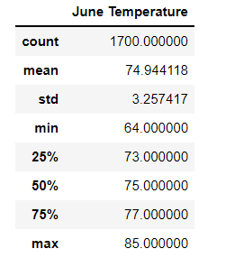
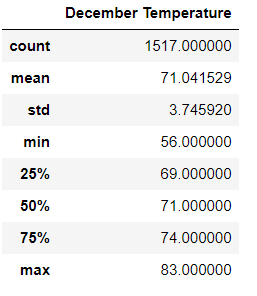
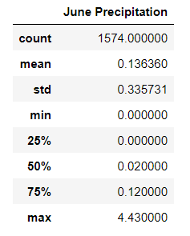
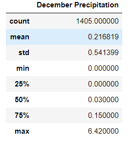

# Surf_up
Weekly Challenge 9 - Analysing weather data using SQLite and SQLalchemy.

## Overview of the Project

### Purpose and Backgroud

The purpose of this project is to analysze the weather in hawaii islands to set up a surf shop, that can be presented to the investor. The investor specifically demanded to get
the weather data in the month of June and December in order to determine if the surf and ice cream shop buisness is sustainable year-round. In this analysis we have used SQLite
which is a version of SQL that can be stored locally instead of on a database server. SQLalchemy is used to query SQLite databases and it allows integration of statistical analysis
with dataframe analysis. We have analysed the weather data for around 7 years in the islands for the month of June and December and prepared a statistical summary of the same.

## Results 

- To retrieve the temperature in the month of june we filtered out temperature field from the measurement table using extract function. We then put the data in the dataframe to get
  the staistical summary as below. We can see from the below summary that in the month of june the temperature in Oahu island is nearly 74 degree Fahrenheit, which is quite pleasant.
  Also the minimum temparture in june is 64 degree Fahrenheit and it can go upto 85 degree Fahrenheit.
  
	 
	
- After analysisng the data for temperature in december in the islands for around 7 years, we got the below statistical summary . We can see that the minimum temperature in the month
  of December is 56 degree Fahrenheit and it can go upto 83 degree Fahrenheit.
  
	 	
	
- We can see from both data summary above that the temperature in Oahu islands in Hawaii is almost the same year round. Even in the december the temparature is fairly the same as in June and is quite pleasant. So even if the surf and ice cream shops are opened up they will do good all year round with a pleasant sunny weather. The difference in weather in december is just the minimum temperature that can drop to 56 degree Fahrenheit.
  

## Summary

1. We have also provided additional queries to show the precipitation in the month of june and december as below. The precipitation recorded for the seven years in the islands for June is around 0.13inch and in december its around 0.2inch which can go upto 6.42inches . So december month can experience some more rain and wet weather than the month of June.
		
	 

     
		
2. Surf and icecream shops can do really well year round in the Oahu islands as the weather is sunny. But the december month can experince some rainfall and slight temperature drops as compared to summers in June.